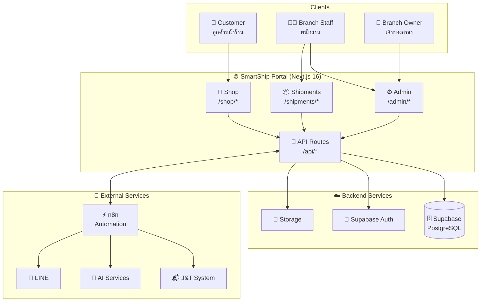
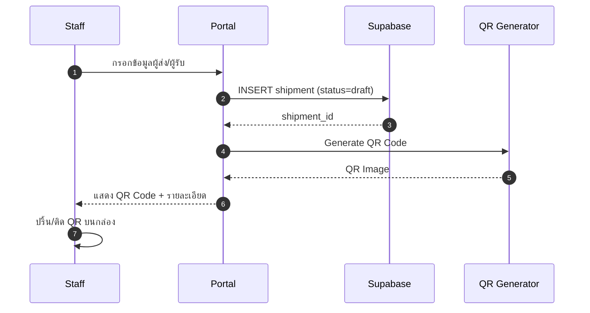
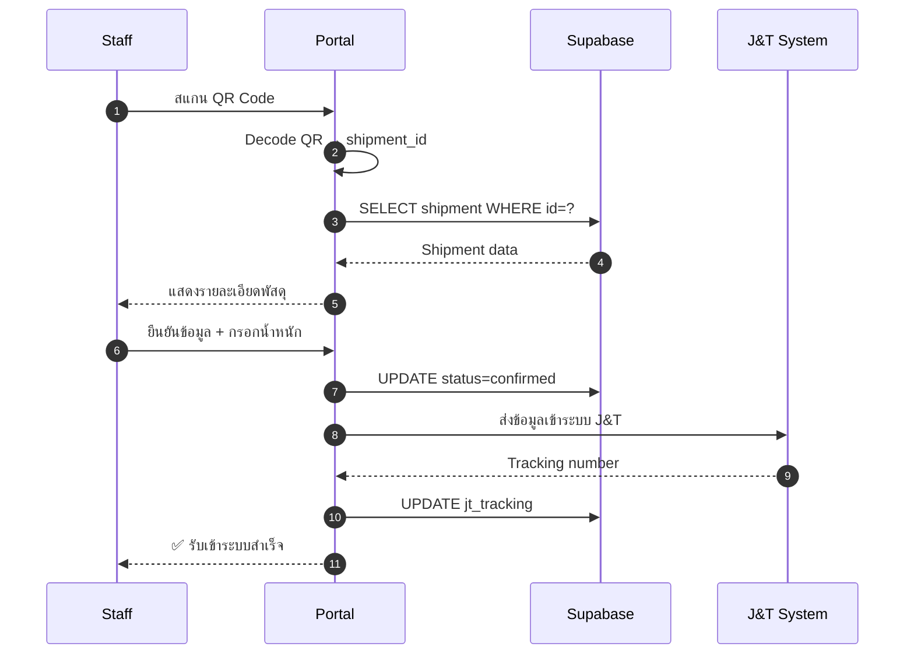
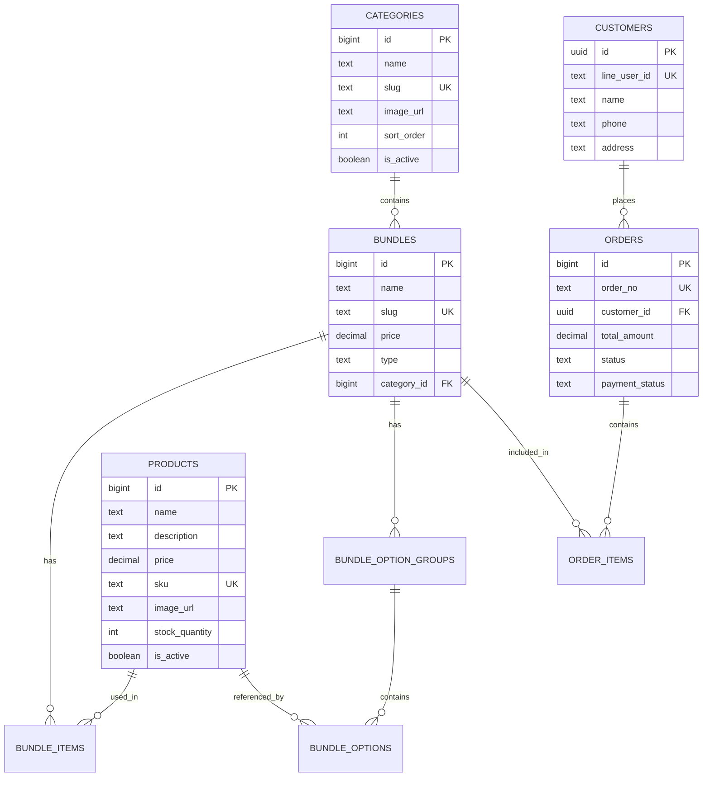
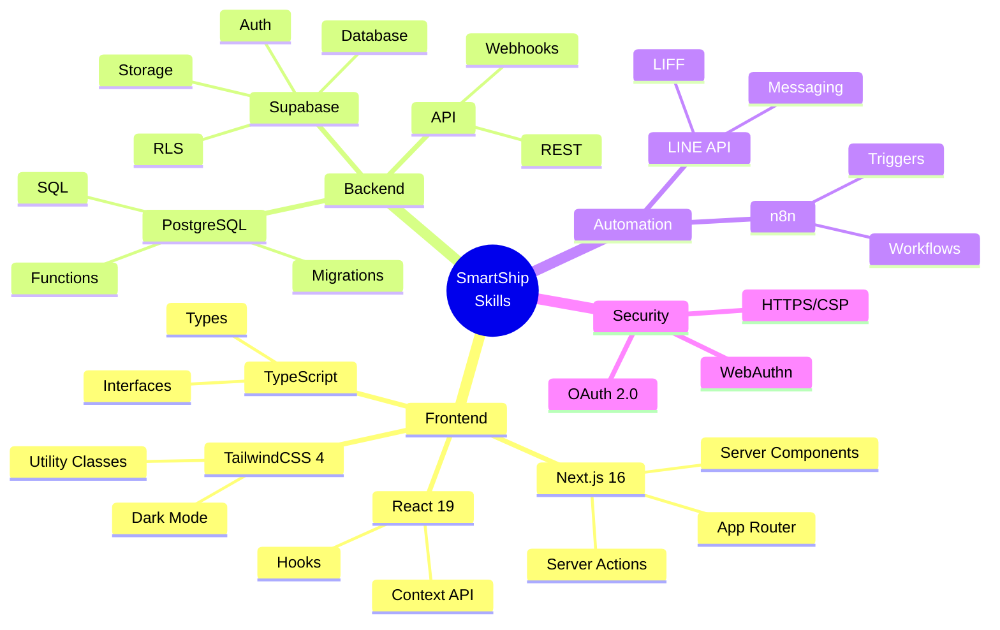

# SmartShip Branch Assistant

ระบบผู้ช่วยสาขาขนส่งพัสดุ (J&T Franchise) - ลดขั้นตอนหน้าร้าน, ลดการพิมพ์ซ้ำ, เตรียมต่อยอด AI + Automation

---

## 📋 สารบัญ (Table of Contents)

- [ภาพรวมโปรเจกต์](#-ภาพรวมโปรเจกต์)
- [Tech Stack & Versions](#-tech-stack--versions)
- [Prerequisites](#-prerequisites)
- [Installation Guide](#-installation-guide)
- [Environment Setup](#-environment-setup)
- [Database Setup](#-database-setup)
- [Running the Application](#-running-the-application)
- [Project Structure](#-project-structure)
- [Architecture Diagram](#-architecture-diagram)
- [Features](#-features)
- [Security](#-security)
- [Troubleshooting](#-troubleshooting)

---

## 🎯 ภาพรวมโปรเจกต์

**SmartShip Branch Assistant** คือระบบ Portal สำหรับสาขาขนส่ง ช่วยจัดการ "ขั้นตอนหน้าร้าน" ให้เป็นระบบ:

1. **ส่วนที่ 1 – ระบบหน้าร้านของสาขา** – เก็บข้อมูลผู้ส่ง/ผู้รับ, สร้าง QR Code
2. **ส่วนที่ 2 – ระบบรับเข้า J&T** – สแกน QR เพื่อดึงข้อมูลได้เร็ว, ยืนยันส่งเข้าระบบ

---

## 🛠 Tech Stack & Versions

### Core Framework

| Technology | Version | Description |
|------------|---------|-------------|
| **Next.js** | `16.0.7` | React Framework with App Router |
| **React** | `19.2.0` | UI Library |
| **React DOM** | `19.2.0` | React DOM Renderer |
| **TypeScript** | `^5` | Type-safe JavaScript |

### Database & Auth

| Technology | Version | Description |
|------------|---------|-------------|
| **Supabase JS** | `^2.86.2` | Supabase Client |
| **Supabase SSR** | `^0.8.0` | Server-Side Rendering support |
| **PostgreSQL** | (via Supabase) | Database |

### Styling

| Technology | Version | Description |
|------------|---------|-------------|
| **TailwindCSS** | `^4` | Utility-first CSS |
| **@tailwindcss/postcss** | `^4` | PostCSS plugin |

### QR Code & Scanner

| Technology | Version | Description |
|------------|---------|-------------|
| **react-qr-code** | `^2.0.18` | QR Code Generator |
| **@yudiel/react-qr-scanner** | `^2.5.0` | QR Code Scanner |
| **promptpay-qr** | `^0.5.0` | PromptPay QR Generator |

### Security & Auth

| Technology | Version | Description |
|------------|---------|-------------|
| **bcryptjs** | `^3.0.3` | Password Hashing |
| **@simplewebauthn/browser** | `^13.2.2` | WebAuthn Browser API |
| **@simplewebauthn/server** | `^13.2.2` | WebAuthn Server API |
| **@marsidev/react-turnstile** | `^1.4.1` | Cloudflare Turnstile |

### UI Components

| Technology | Version | Description |
|------------|---------|-------------|
| **lucide-react** | `^0.562.0` | Icon Library |

---

## 📦 Prerequisites

ก่อนติดตั้ง ตรวจสอบว่าเครื่องมีโปรแกรมเหล่านี้:

| Software | Minimum Version | Check Command |
|----------|-----------------|---------------|
| **Node.js** | `18.17.0+` (แนะนำ `20.x` หรือ `22.x`) | `node --version` |
| **npm** | `9.0+` | `npm --version` |
| **Git** | `2.x` | `git --version` |

### ติดตั้ง Node.js

```bash
# Windows - ดาวน์โหลดจาก https://nodejs.org/
# หรือใช้ winget
winget install OpenJS.NodeJS.LTS

# macOS - ใช้ Homebrew
brew install node@20

# Linux - ใช้ nvm (แนะนำ)
curl -o- https://raw.githubusercontent.com/nvm-sh/nvm/v0.39.0/install.sh | bash
nvm install 20
nvm use 20
```

---

## 🚀 Installation Guide

### Step 1: Clone Repository

```bash
# Clone the repository
git clone https://github.com/Prakasit993/SmartShip-Branch.git

# Navigate to project directory
cd SmartShip-Branch
```

### Step 2: Install Dependencies

```bash
# Install all npm packages
npm install
```

> ⏱️ การติดตั้งใช้เวลาประมาณ 1-2 นาที

### Step 3: Verify Installation

```bash
# Check if installation successful
npm list --depth=0
```

---

## ⚙️ Environment Setup

### Step 1: Create Environment File

```bash
# Copy template (ถ้ามี .env.example)
cp .env.example .env.local

# หรือสร้างไฟล์ใหม่
touch .env.local  # Linux/macOS
# Windows: สร้างไฟล์ .env.local ด้วย Notepad หรือ IDE
```

### Step 2: Configure Environment Variables

เพิ่มค่าต่อไปนี้ใน `.env.local`:

```bash
# ===== SUPABASE (Required) =====
NEXT_PUBLIC_SUPABASE_URL=https://xxxxxxxxxxxxx.supabase.co
NEXT_PUBLIC_SUPABASE_ANON_KEY=eyJhbGciOiJIUzI1NiIsInR5cCI6IkpXVCJ9...
SUPABASE_SERVICE_ROLE_KEY=eyJhbGciOiJIUzI1NiIsInR5cCI6IkpXVCJ9...

# ===== ADMIN ACCESS (Required) =====
ADMIN_PASSWORD=MySecure@Password123!
ADMIN_EMAIL=admin@yourcompany.com
STAFF_EMAILS=staff1@company.com,staff2@company.com

# ===== n8n AUTOMATION (Optional) =====
N8N_ORDER_WEBHOOK_URL=https://your-n8n.com/webhook/order-confirmation
N8N_SLIP_WEBHOOK_URL=https://your-n8n.com/webhook/slip-uploaded

# ===== SITE CONFIG =====
NEXT_PUBLIC_SITE_URL=http://localhost:3000
```

### Environment Variables Reference

| Variable | Required | Client-side | Description |
|----------|:--------:|:-----------:|-------------|
| `NEXT_PUBLIC_SUPABASE_URL` | ✅ | ✅ | Supabase project URL |
| `NEXT_PUBLIC_SUPABASE_ANON_KEY` | ✅ | ✅ | Supabase anon key |
| `SUPABASE_SERVICE_ROLE_KEY` | ✅ | ❌ | Service role key (bypasses RLS) |
| `ADMIN_PASSWORD` | ✅ | ❌ | Admin login password |
| `ADMIN_EMAIL` | ✅ | ❌ | Admin email |
| `STAFF_EMAILS` | ❌ | ❌ | Staff emails (comma-separated) |
| `N8N_ORDER_WEBHOOK_URL` | ❌ | ❌ | n8n webhook URL |
| `NEXT_PUBLIC_SITE_URL` | ❌ | ✅ | Production site URL |

---

## 🗄️ Database Setup

### Option A: Using Supabase (Recommended)

1. **สร้าง Supabase Project** ที่ [supabase.com](https://supabase.com)

2. **รัน Schema** ใน SQL Editor:

```sql
-- ไปที่ database/db/schema.sql แล้ว copy มารัน
-- หรือรันทีละไฟล์ใน database/db/migrations/
```

3. **รัน Migrations** ตามลำดับ:

```
database/db/migrations/
├── 20260110_operations.sql
├── 20260110_rpc_stock.sql
├── 20260111_add_product_attributes.sql
├── 20260111_add_product_attributes_safe.sql
├── 20260111_add_product_images.sql
├── 20260114_fix_rls_security.sql
├── 20260115_security_hardening.sql
├── 20260119_add_bundle_dimensions.sql
├── 20260123_sync_bundle_dimensions.sql
├── add_email_and_rls.sql
└── v2_reviews_coupons.sql
```

### Option B: Local PostgreSQL

```bash
# สร้าง database
createdb smartship

# รัน schema
psql -d smartship -f database/db/schema.sql

# รัน migrations
for f in database/db/migrations/*.sql; do
  psql -d smartship -f "$f"
done
```

---

## ▶️ Running the Application

### Development Mode

```bash
# Start development server
npm run dev

# เปิด browser ที่ http://localhost:3000
```

### Production Build

```bash
# Build for production
npm run build

# Start production server
npm run start
```

### Available Scripts

| Command | Description |
|---------|-------------|
| `npm run dev` | Start development server (port 3000) |
| `npm run build` | Create production build |
| `npm run start` | Start production server |

---

## 📁 Project Structure

```
SmartShip-Branch/
├── 📂 app/                    # Next.js App Router
│   ├── 📂 (shop)/             # Shop pages (ฝั่งลูกค้า)
│   ├── 📂 admin/              # Admin dashboard
│   ├── 📂 api/                # API routes
│   ├── 📂 actions/            # Server actions
│   ├── 📂 auth/               # Authentication
│   ├── 📂 components/         # React components
│   ├── 📂 context/            # React contexts
│   ├── 📂 hooks/              # Custom hooks
│   ├── 📂 lib/                # Utility libraries
│   ├── 📂 shipments/          # Shipment management
│   ├── 📂 types/              # TypeScript types
│   ├── 📜 layout.tsx          # Root layout
│   ├── 📜 page.tsx            # Home page
│   └── 📜 globals.css         # Global styles
│
├── 📂 database/
│   └── 📂 db/
│       ├── 📜 schema.sql      # Main database schema
│       ├── 📂 migrations/     # SQL migrations
│       └── 📂 seeds/          # Seed data
│
├── 📂 docs/                   # Documentation
│   ├── 📜 architecture.md     # System architecture
│   ├── 📜 data-model.md       # Data model documentation
│   ├── 📜 security.md         # Security guidelines
│   ├── 📜 use-cases.md        # Use case documentation
│   └── 📜 todo.md             # Project TODO list
│
├── 📂 public/                 # Static assets
├── 📂 scripts/                # Utility scripts
├── 📂 src/                    # Source utilities
│
├── 📜 middleware.ts           # Next.js middleware
├── 📜 next.config.ts          # Next.js configuration
├── 📜 package.json            # Dependencies
├── 📜 tsconfig.json           # TypeScript config
├── 📜 postcss.config.mjs      # PostCSS config
└── 📜 README.md               # This file
```

---

## 🏗️ Architecture Diagram

### System Overview



### Request Flow: Create Shipment



### Request Flow: Confirm Shipment



### Database Entity Relationship



---

## ✨ Features

### 🛒 Shop (ฝั่งลูกค้า)
- ✅ แสดงสินค้าและ Bundle
- ✅ ตะกร้าสินค้า
- ✅ ชำระเงินผ่าน PromptPay
- ✅ ติดตามสถานะ Order

### ⚙️ Admin Dashboard
- ✅ จัดการ Products / Categories / Bundles
- ✅ จัดการ Orders
- ✅ จัดการ Stock
- ✅ รายงานยอดขาย

### 📦 Shipments
- ✅ สร้าง Shipment Draft + QR Code
- ✅ สแกน QR และยืนยัน Shipment
- ✅ เชื่อมต่อระบบ J&T (จำลอง)

### 🔐 Security
- ✅ Supabase Auth (Google OAuth)
- ✅ RBAC (Admin / Staff)
- ✅ Row Level Security (RLS)
- ✅ HTTPS + Security Headers

---

## 🔒 Security

### Security Headers (next.config.ts)

- ✅ Content-Security-Policy
- ✅ X-Frame-Options: DENY
- ✅ X-Content-Type-Options: nosniff
- ✅ Strict-Transport-Security (HSTS)
- ✅ Referrer-Policy

### Role-Based Access Control

| Role | Access |
|------|--------|
| **Admin** | Full access: Products, Bundles, Settings, Orders, Stock |
| **Staff** | Limited: Dashboard, Orders only |
| **Customer** | Shop, own Orders only |

---

## ❓ Troubleshooting

### Common Issues

#### 1. `npm install` fails

```bash
# Clear npm cache and retry
npm cache clean --force
rm -rf node_modules package-lock.json
npm install
```

#### 2. Port 3000 already in use

```bash
# Windows
netstat -ano | findstr :3000
taskkill /PID <PID> /F

# macOS/Linux
lsof -i :3000
kill -9 <PID>
```

#### 3. Supabase connection error

- ตรวจสอบ `NEXT_PUBLIC_SUPABASE_URL` และ `NEXT_PUBLIC_SUPABASE_ANON_KEY`
- ตรวจสอบว่า Supabase project ยัง active อยู่

#### 4. Build errors

```bash
# ลบ cache และ build ใหม่
rm -rf .next
npm run build
```

---

## 🎓 Skills Roadmap & Learning Resources

### 📊 Skills Required



### 🛤️ Learning Path (แนะนำเรียนตามลำดับ)

#### Phase 1: Foundation (1-2 สัปดาห์)

| # | Skill | Level | Priority | Description |
|---|-------|-------|----------|-------------|
| 1 | **HTML/CSS/JavaScript** | Basic | 🔴 Required | พื้นฐานเว็บ |
| 2 | **React Basics** | Basic | 🔴 Required | Components, Props, State, Hooks |
| 3 | **TypeScript** | Basic | 🟡 High | Types, Interfaces, Generics |

#### Phase 2: Core Stack (2-4 สัปดาห์)

| # | Skill | Level | Priority | Description |
|---|-------|-------|----------|-------------|
| 4 | **Next.js App Router** | Intermediate | 🔴 Required | Server Components, Routing, API Routes |
| 5 | **TailwindCSS** | Intermediate | 🟡 High | Utility-first CSS, Responsive Design |
| 6 | **Supabase** | Intermediate | 🔴 Required | Auth, Database, Storage |

#### Phase 3: Advanced (2-4 สัปดาห์)

| # | Skill | Level | Priority | Description |
|---|-------|-------|----------|-------------|
| 7 | **PostgreSQL/SQL** | Intermediate | 🟡 High | Queries, Joins, Functions, RLS |
| 8 | **Server Actions** | Intermediate | 🟡 High | Form handling, Mutations |
| 9 | **Authentication** | Intermediate | 🟡 High | OAuth, Sessions, Middleware |

#### Phase 4: Integration (ตามความจำเป็น)

| # | Skill | Level | Priority | Description |
|---|-------|-------|----------|-------------|
| 10 | **n8n Automation** | Basic | 🟢 Optional | Workflows, Webhooks |
| 11 | **LINE API/LIFF** | Basic | 🟢 Optional | Messaging, Login |
| 12 | **WebAuthn/Passkeys** | Basic | 🟢 Optional | Passwordless auth |

---

### 📖 Learning Resources

#### 🎯 Next.js 16 (App Router)

| Resource | Type | Language | Link |
|----------|------|----------|------|
| **Next.js Official Docs** | Docs | EN | [nextjs.org/docs](https://nextjs.org/docs) |
| **Next.js Learn Course** | Tutorial | EN | [nextjs.org/learn](https://nextjs.org/learn) |
| **Lee Robinson YouTube** | Video | EN | [youtube.com/@leerob](https://www.youtube.com/@leerob) |
| **Next.js Thai Tutorial** | Video | TH | ค้นหาใน YouTube |

#### ⚛️ React 19

| Resource | Type | Language | Link |
|----------|------|----------|------|
| **React Official Docs** | Docs | EN | [react.dev](https://react.dev) |
| **React 19 What's New** | Article | EN | [react.dev/blog](https://react.dev/blog) |

#### 🟦 TypeScript

| Resource | Type | Language | Link |
|----------|------|----------|------|
| **TypeScript Handbook** | Docs | EN | [typescriptlang.org](https://www.typescriptlang.org/docs/) |
| **Total TypeScript** | Course | EN | [totaltypescript.com](https://www.totaltypescript.com/) |

#### 🗄️ Supabase

| Resource | Type | Language | Link |
|----------|------|----------|------|
| **Supabase Docs** | Docs | EN | [supabase.com/docs](https://supabase.com/docs) |
| **Supabase YouTube** | Video | EN | [youtube.com/@Supabase](https://www.youtube.com/@Supabase) |
| **Next.js + Supabase** | Guide | EN | [supabase.com/docs/guides/auth/server-side/nextjs](https://supabase.com/docs/guides/auth/server-side/nextjs) |

#### 🎨 TailwindCSS 4

| Resource | Type | Language | Link |
|----------|------|----------|------|
| **Tailwind Docs** | Docs | EN | [tailwindcss.com](https://tailwindcss.com) |
| **Tailwind v4 Beta** | Docs | EN | [tailwindcss.com/blog](https://tailwindcss.com/blog) |
| **Tailwind UI** | Components | EN | [tailwindui.com](https://tailwindui.com) |

#### 🔐 PostgreSQL & Security

| Resource | Type | Language | Link |
|----------|------|----------|------|
| **PostgreSQL Tutorial** | Docs | EN | [postgresqltutorial.com](https://www.postgresqltutorial.com/) |
| **Supabase RLS Guide** | Docs | EN | [supabase.com/docs/guides/auth/row-level-security](https://supabase.com/docs/guides/auth/row-level-security) |

#### ⚡ n8n Automation

| Resource | Type | Language | Link |
|----------|------|----------|------|
| **n8n Docs** | Docs | EN | [docs.n8n.io](https://docs.n8n.io) |
| **n8n Community** | Forum | EN | [community.n8n.io](https://community.n8n.io) |

---

### 🏆 Skill Checklist (ใช้ตรวจสอบความพร้อม)

#### Frontend Developer

- [ ] สร้าง React Component ได้
- [ ] ใช้ useState, useEffect, useContext ได้
- [ ] เข้าใจ Next.js App Router (page.tsx, layout.tsx, loading.tsx)
- [ ] สร้าง Server Components และ Client Components ได้
- [ ] ใช้ TailwindCSS จัด Layout และ Responsive ได้
- [ ] เขียน TypeScript พื้นฐานได้

#### Backend Developer

- [ ] เขียน SQL Query ได้ (SELECT, INSERT, UPDATE, JOIN)
- [ ] ใช้ Supabase Client ดึง/บันทึกข้อมูลได้
- [ ] ตั้งค่า Row Level Security (RLS) ได้
- [ ] สร้าง API Routes ใน Next.js ได้
- [ ] ใช้ Server Actions จัดการ Form ได้

#### Full Stack Developer

- [ ] ทำ Authentication ด้วย Supabase Auth ได้
- [ ] สร้าง CRUD ครบวงจรได้
- [ ] Deploy ขึ้น Vercel ได้
- [ ] ตั้งค่า Environment Variables ได้
- [ ] Debug และแก้ไขปัญหาได้

---

## 📚 Documentation

- [Architecture](./docs/architecture.md) - System architecture
- [Data Model](./docs/data-model.md) - Database design
- [Security](./docs/security.md) - Security guidelines
- [Use Cases](./docs/use-cases.md) - Use case documentation
- [TODO](./docs/todo.md) - Project roadmap

---

## 📄 License

This project is private and proprietary.

---

## 🙋‍♂️ Contact

For questions or support, please contact the repository owner.
