# Project To-Do – SmartShip Branch Assistant

รวมรายการงานทั้งหมดที่ใช้วางแผนใน ClickUp / GitHub Issues  
(ติ๊กเช็กได้ตามความคืบหน้า)

---

## 0. Repo & Project Setup

- [ ] สร้าง GitHub repo `SmartShip-Branch` (หรือชื่อใกล้เคียง)
- [ ] เพิ่มไฟล์ `README.md` (Project Overview + Goals)
- [ ] สร้างโฟลเดอร์ `docs/`
- [ ] สร้างไฟล์เอกสารหลัก:
  - [ ] `docs/use-cases.md`
  - [ ] `docs/data-model.md`
  - [ ] `docs/architecture.md`
  - [ ] `docs/security.md`
  - [ ] `docs/todo.md` (ไฟล์นี้)

---

## 1. Analysis & Documentation

- [ ] เก็บข้อมูล AS-IS Process ของสาขา J&T (ทำเป็นข้อความ/แผนภาพ)
- [ ] เขียน Problem Statement & Business Goals
- [ ] ระบุ Actors หลัก:
  - [ ] Customer
  - [ ] Branch Staff
  - [ ] Branch Owner
  - [ ] SmartShip System
  - [ ] J&T System
  - [ ] AI Services
- [ ] นิยาม Scope ของระบบ (In Scope / Out of Scope)
- [ ] เขียน Use Case รายละเอียด:
  - [ ] UC-01: Create Shipment Draft & QR (Part 1)
  - [ ] UC-02: Scan QR & Confirm Shipment in J&T (Part 2)
  - [ ] UC-03: Create Shipment at Counter (No LINE)
  - [ ] UC-04: Daily Shipment Summary Report
  - [ ] UC-05: Customer Management (VIP/Regular)
- [ ] สรุป Use Case ทั้งหมดใน `docs/use-cases.md`
- [ ] วาด/อธิบาย Context Diagram / Level 0 DFD (เป็นข้อความหรือภาพ)

---

## 2. Data & Architecture Design

### 2.1 Data Model

- [ ] ออกแบบ Conceptual Data Model (Entities หลัก)
- [ ] เติมรายละเอียดใน `docs/data-model.md` สำหรับ:
  - [ ] `branches`
  - [ ] `customers`
  - [ ] `shipments`
  - [ ] `branch_daily_report`
  - [ ] `thai_locations` (reference table)
- [ ] ระบุฟิลด์สำคัญ + key / index ที่จำเป็น
- [ ] ระบุ flag สำหรับคุณภาพข้อมูล:
  - [ ] `address_validated`
  - [ ] `address_needs_staff_review`
  - [ ] `status` (draft/confirmed/sent_to_jt/...)

### 2.2 Architecture

- [ ] เติม `docs/architecture.md` (High-Level Architecture)
- [ ] อธิบาย:
  - [ ] Actors & External Systems
  - [ ] Presentation Layer (Staff Portal / LINE/LIFF)
  - [ ] Application & Integration Layer (n8n หรือเทียบเท่า)
  - [ ] Data Layer (PostgreSQL / Supabase)
  - [ ] External Services (J&T System, AI Services, LINE)
- [ ] ระบุ Main Flows ระดับสถาปัตยกรรม:
  - [ ] Flow A – UC-01: Create Shipment Draft & QR
  - [ ] Flow B – UC-02: Scan QR & Confirm Shipment in J&T
  - [ ] Flow C – Daily Summary (UC-04)
- [ ] ใส่ Design Considerations:
  - [ ] Tool-agnostic (เปลี่ยนจาก n8n ไปใช้ขององค์กรได้)
  - [ ] Scalability (รองรับหลายสาขา)
  - [ ] Security & Compliance (โยงไป `docs/security.md`)

---

## 3. MVP Implementation (Part 1 – Branch System)

### 3.1 Backend & Database

- [ ] สร้างฐานข้อมูล (เช่น Supabase / PostgreSQL)
- [ ] สร้างตาราง:
  - [ ] `branches`
  - [ ] `customers`
  - [ ] `shipments`
  - [ ] `branch_daily_report`
  - [ ] `thai_locations`
- [ ] Seed ข้อมูล `branches` (ที่อยู่สาขาจริง)
- [ ] เตรียม/อิมพอร์ตข้อมูล `thai_locations` (จังหวัด/อำเภอ/ตำบล/รหัสไปรษณีย์)

### 3.2 Staff Portal (Web App)

- [ ] ตั้งโปรเจกต์ Web App (เช่น Next.js/React)
- [ ] หน้าจอ:
  - [ ] หน้า Login (Staff / Owner)
  - [ ] ฟอร์มสร้าง Shipment (Part 1)
  - [ ] หน้าแสดง QR Code และสรุปข้อมูลพัสดุ
  - [ ] หน้า “รับเข้าระบบ J&T (Part 2)” + สแกน QR
  - [ ] หน้า Customer Management (ค้น/แก้ลูกค้าประจำ)
  - [ ] หน้าแสดงรายงานพื้นฐาน (ดึงจาก `branch_daily_report`)
- [ ] เชื่อมต่อ Backend / DB ผ่าน API หรือ Supabase client

---

## 4. Automation & AI (n8n / Workflow Layer)

- [ ] ติดตั้ง/ตั้งค่า n8n (หรือเลือกเครื่องมือ Orchestrator อื่น)
- [ ] สร้าง Credentials ที่จำเป็น:
  - [ ] DB (PostgreSQL/Supabase)
  - [ ] AI Service (เช่น DeepSeek / OpenAI)
  - [ ] LINE / J&T API (ถ้าใช้)
- [ ] Workflow A: `CreateShipmentDraft`
  - [ ] รับข้อมูลจาก Staff Portal / HTTP Request
  - [ ] ตรวจสอบข้อมูลที่อยู่กับ `thai_locations`
  - [ ] เรียก AI ช่วย normalize address (ถ้าใช้)
  - [ ] บันทึก `customers` + `shipments` (สถานะ `draft`)
  - [ ] ส่งข้อมูลกลับไปให้ Frontend สำหรับสร้าง QR
- [ ] Workflow B: `ConfirmShipmentAndSendToJT`
  - [ ] รับ `shipment_id` จากการสแกน QR
  - [ ] ดึง shipment จาก DB
  - [ ] อัปเดตข้อมูลเพิ่ม (น้ำหนัก, ประเภทบริการ, COD)
  - [ ] ส่งข้อมูลไป J&T System (API / automation)
  - [ ] เปลี่ยนสถานะ shipment เป็น `sent_to_jt` หรือ `confirmed`
- [ ] Workflow C: `DailySummaryReport`
  - [ ] Trigger ทุกวันตามเวลาปิดร้าน
  - [ ] Query `shipments` ของวันนั้น
  - [ ] รวมยอด/สถิติ
  - [ ] เรียก AI เขียน summary text
  - [ ] บันทึกลง `branch_daily_report`
  - [ ] ส่งสรุปไป Owner (LINE / Email)

---

## 5. Integration & Reporting

- [ ] วิเคราะห์วิธีเชื่อมกับ J&T:
  - [ ] ปัจจุบัน (กรอกมือจากข้อมูลบนหน้าจอ SmartShip)
  - [ ] อนาคต (API / QR Payload)
- [ ] ออกแบบฟอร์แมต QR Payload ให้ชัดเจน:
  - [ ] ต้องมี: branch code, shipment_id, vip_code, sender/receiver summary
- [ ] หน้า Dashboard / รายงาน:
  - [ ] รายงานยอดส่งรายวัน (ดึงจาก `branch_daily_report`)
  - [ ] filter ตามวันที่, สาขา, ประเภทบริการ
- [ ] ระบุ Next Step สำหรับการเชื่อม JT API จริงในอนาคต

---

## 6. Presentation & Portfolio

- [ ] เตรียม Slide Deck สำหรับพรีเซนต์โปรเจกต์นี้ (6–10 สไลด์):
  - [ ] Slide 1 – Project Intro (SmartShip Branch Assistant คืออะไร)
  - [ ] Slide 2 – Business Problem & Pain Points
  - [ ] Slide 3 – Goals & Scope
  - [ ] Slide 4 – Use Cases หลัก (UC-01 – UC-04)
  - [ ] Slide 5 – Data Model / Architecture Overview
  - [ ] Slide 6 – ตัวอย่างหน้าจอ/Flow (Prototype หรือ Screenshot)
  - [ ] Slide 7 – AI & Automation ใช้ตรงไหน
  - [ ] Slide 8 – Security & Next Steps
- [ ] เขียน Section “Role as System Analyst” ใน README / Slide:
  - [ ] วิเคราะห์งานจริงจากธุรกิจของตัวเอง
  - [ ] ออกแบบ Process, Use Case, Data Model, Architecture, Security
  - [ ] วาง Roadmap จาก MVP ไปสู่ Multi-branch

---

## 7. Security & Compliance

- [ ] เติมรายละเอียดใน `docs/security.md` (ตามหัวข้อหลัก)
- [ ] ออกแบบ RBAC:
  - [ ] สิทธิ์ Staff
  - [ ] สิทธิ์ Branch Owner
  - [ ] สิทธิ์ Admin/System Owner
- [ ] Implement Login / Auth สำหรับ Staff Portal
- [ ] บังคับใช้ HTTPS ทุกการเชื่อมต่อ:
  - [ ] Staff Portal ↔ Backend
  - [ ] Backend ↔ DB
  - [ ] n8n ↔ External Services
- [ ] ตั้งค่าการเก็บ Secret:
  - [ ] API Keys / Tokens เก็บใน Environment Variables / n8n Credentials
  - [ ] ห้าม hard-code ใน source code
- [ ] Implement Address Validation:
  - [ ] ใช้ `thai_locations` ตรวจ combination ตำบล/อำเภอ/จังหวัด/รหัสไปรษณีย์
  - [ ] Popup ให้เลือก “ยืนยันตามที่ระบบแนะนำ” หรือ “ให้พนักงานตรวจสอบ”
  - [ ] ตั้งค่า flag `address_validated`, `address_needs_staff_review`
- [ ] ออกแบบ/สร้าง `audit_log` (Audit Trail):
  - [ ] บันทึกการสร้าง/แก้ไข/เปลี่ยนสถานะ shipment
  - [ ] บันทึกการแก้ข้อมูลลูกค้า
- [ ] ปรับ Logging ให้ไม่เก็บข้อมูลอ่อนไหวใน log:
  - [ ] เบอร์โทร
  - [ ] ที่อยู่เต็ม
  - [ ] VIP Code
- [ ] วาง Data Retention Policy:
  - [ ] เก็บรายละเอียด shipment กี่ปี
  - [ ] วิธี anonymize / ลบข้อมูลเก่า
- [ ] ตั้งค่า Backup & Recovery:
  - [ ] Backup DB รายวัน
  - [ ] ทดสอบ Restore เป็นระยะ
- [ ] ทบทวน Terms/Privacy ของ AI Services / J&T / LINE ที่ใช้

---

### 7.5 🔐 Admin Panel Setup & Security (การตั้งค่า Admin และความปลอดภัย)

#### Environment Variables ที่จำเป็น

สร้างไฟล์ `.env.local` และตั้งค่าดังนี้:

```bash
# ===== ADMIN ACCESS CONTROL =====
# รหัสผ่านสำหรับ login หน้า admin (ต้องเป็นรหัสที่คาดเดายาก!)
ADMIN_PASSWORD=your-super-secure-password-here

# Email ของ Admin หลัก (จะเห็นเมนูทุกอย่าง: Products, Settings, Bundles, Stock)
ADMIN_EMAIL=admin@yourcompany.com

# Email ของ Staff (คั่นด้วย comma) - เห็นเฉพาะ Dashboard และ Orders
STAFF_EMAILS=staff1@company.com,staff2@company.com

# ===== SUPABASE =====
NEXT_PUBLIC_SUPABASE_URL=https://xxxxx.supabase.co
NEXT_PUBLIC_SUPABASE_ANON_KEY=eyJhbG...
SUPABASE_SERVICE_ROLE_KEY=eyJhbG...  # ใช้เฉพาะฝั่ง server
```

#### วิธีเพิ่ม Admin/Staff

| Role | วิธีตั้งค่า | สิทธิ์ |
|------|------------|--------|
| **Admin** | ใส่ email ใน `ADMIN_EMAIL` | เห็นทุกเมนู: Dashboard, Orders, Products, Bundles, Stock, Settings |
| **Staff** | ใส่ email ใน `STAFF_EMAILS` | เห็นเฉพาะ: Dashboard, Orders |
| **Password Login** | ใช้ `ADMIN_PASSWORD` ใน login หน้า admin | Full Admin Access |

#### Security Protections

**🛡️ สำหรับ Admin Panel**

| Protection | Status | รายละเอียด |
|------------|--------|------------|
| Middleware Protection | ✅ | ทุก route `/admin/*` ถูกตรวจสอบ session |
| HttpOnly Cookie | ✅ | ป้องกัน XSS ขโมย session |
| Email Allowlist | ✅ | OAuth login ต้องมี email ใน `ADMIN_EMAIL` หรือ `STAFF_EMAILS` |
| RBAC | ✅ | Staff ไม่สามารถเข้าหน้า Products/Settings/Bundles/Stock |
| Secure Auth | ✅ | ใช้ `supabase.auth.getUser()` (server-side validation) |
| Security Logging | ✅ | บันทึกการ login สำเร็จ/ล้มเหลว |

**🛡️ สำหรับ Customer (User ธรรมดา)**

| Protection | Status | รายละเอียด |
|------------|--------|------------|
| Route Protection | ✅ | `/profile/*` ต้องมี auth cookie |
| Row Level Security (RLS) | ✅ | Users เห็นเฉพาะ orders ของตัวเอง |
| OAuth only | ✅ | Login ผ่าน Google/Facebook (Supabase Auth) |
| Session Validation | ✅ | ตรวจสอบ Supabase auth token |

#### Best Practices

```bash
# ❌ อย่าทำ (รหัสผ่านอ่อนแอ)
ADMIN_PASSWORD=admin123
ADMIN_PASSWORD=password

# ✅ ควรทำ (รหัสผ่านแข็งแรง)
ADMIN_PASSWORD=Ks8#mP2$vQ9@nL4!
```

**ข้อปฏิบัติ:**
1. **รหัสผ่าน** - ใช้อย่างน้อย 12 ตัวอักษร มีตัวพิมพ์ใหญ่/เล็ก ตัวเลข และสัญลักษณ์
2. **HTTPS** - ใช้ HTTPS เสมอใน production
3. **Rotate Password** - เปลี่ยนรหัสผ่าน admin ทุก 3-6 เดือน
4. **Review Staff List** - ตรวจสอบรายชื่อ staff emails เป็นระยะ

---

## 8. Optional / Future Enhancements

- [ ] รองรับ Multi-Branch (หลายสาขาในระบบเดียว)
- [ ] เพิ่มระบบ Notification (แจ้งลูกค้าเมื่อสถานะเปลี่ยน)
- [ ] เพิ่ม Dashboard เชิงลึก (Top ลูกค้าประจำ, สถิติปลายทาง, Peak time)
- [ ] PoC เชื่อม J&T API (ถ้ามีเอกสารให้ใช้จริง)
- [ ] เพิ่ม Unit Test / Integration Test ส่วนสำคัญ

---

# SmartShip Branch Assistant

ระบบผู้ช่วยสาขาขนส่งพัสดุ (ฉบับ J&T Franchise)  
โฟกัสลดขั้นตอนหน้าร้าน, ลดการพิมพ์ซ้ำ, และเตรียมต่อยอดเชื่อม API J&T + AI ช่วยจัดการข้อมูล

---

## 1. Project Overview (ภาพรวมโปรเจกต์)

**SmartShip Branch Assistant** คือระบบ Portal เล็ก ๆ สำหรับสาขาขนส่ง ที่ช่วยจัดการ “ขั้นตอนหน้าร้าน” ให้เป็นระบบมากขึ้น โดยแยกงานออกเป็น 2 ส่วนหลัก:

1. **ส่วนที่ 1 – ระบบหน้าร้านของสาขา (SmartShip System)**  
   - เก็บข้อมูลผู้ส่ง/ผู้รับให้เรียบร้อย  
   - ล็อกที่อยู่ผู้ส่งให้เป็นที่อยู่สาขา  
   - สร้าง Shipment Draft + QR Code สำหรับเอาไปใช้ในขั้นตอนรับเข้าระบบ J&T

2. **ส่วนที่ 2 – ระบบรับเข้าระบบ J&T (Existing J&T System)**  
   - ใช้ QR จากส่วนที่ 1 เพื่อดึงข้อมูลได้เร็ว  
   - พนักงานตรวจสอบ/เติมข้อมูลเพิ่ม แล้วส่งเข้าระบบ J&T (ปัจจุบันยังเป็น “จำลองส่ง” ใน DB)

เป้าหมายของโปรเจกต์นี้คือ **ทำ demo ระดับ System Analyst + Dev** ที่:

- มี **Use Case ชัดเจน (UC-01, UC-02)**  
- มี **ฐานข้อมูลจริง (Supabase / PostgreSQL)**  
- มี **เว็บจริงให้กดใช้งาน (Next.js)**  
- มี **QR Flow ครบวง**: สร้าง → ปริ้น/แสดง → สแกน → ยืนยัน

---

## 2. Business Problem & Goals

### 2.1 Pain Points ปัจจุบัน (มองจากมุมสาขา J&T)

- ลูกค้าต้องเขียนที่อยู่/เบอร์โทรซ้ำ ๆ ทุกครั้ง  
- พนักงานหน้าร้านต้องพิมพ์ข้อมูลซ้ำจากกระดาษเข้าเครื่อง J&T  
- มีโอกาสพิมพ์ผิด (ชื่อ/เบอร์/รหัสไปรษณีย์)  
- เวลาเยอะในขั้นตอน “รับข้อมูล” มากกว่าการจัดการพัสดุจริง ๆ  
- ยังไม่ได้นำ AI / Automation มาช่วยตรวจสอบหรือทวนข้อมูล

### 2.2 Goals ของ SmartShip Branch Assistant

1. **ลดเวลาหน้าร้าน**  
   - ให้พนักงานมีหน้าจอเดียว ที่ต้องพิมพ์น้อยที่สุด  
   - ใช้ QR Code เป็นตัวกลางระหว่างระบบสาขา vs ระบบ J&T

2. **เตรียมฐานข้อมูลกลางของสาขาเอง**  
   - เก็บข้อมูลลูกค้า, ประวัติการส่ง, สถานะพัสดุ (ระดับ branch)  
   - ต่อกับระบบอื่นในอนาคตได้ (n8n, Line, AI ฯลฯ)

3. **ออกแบบให้ต่อยอดเป็น AI/Automation ได้ง่าย**  
   - ตรวจสอบที่อยู่/รหัสไปรษณีย์  
   - แนะนำบริการเสริม (COD, ประกัน ฯลฯ)  
   - ทำรายงานสรุปยอดรายวัน/รายเดือนอัตโนมัติ

---

## 3. Scope ปัจจุบัน (MVP 1 – Implement แล้ว)

### 3.1 ฟีเจอร์ที่ทำงานจริงแล้ว

- ✅ **UC-01: Create Shipment Draft & QR**
  - หน้าเว็บ `/shipments/new`
  - พนักงานกรอกข้อมูลผู้ส่ง/ผู้รับ  
  - ระบบล็อกที่อยู่ผู้ส่ง = ที่อยู่สาขา
  - บันทึกลงตาราง `shipments` (สถานะ `draft`)
  - สร้าง QR Code ที่มี payload:

    ```json
    {
      "shipment_id": "<UUID จาก shipments.id>",
      "branch_code": "BR001"
    }
    ```

- ✅ **UC-02: Scan QR & Confirm Shipment**
  - หน้าเว็บ `/shipments/scan`
  - รับ QR ผ่านกล้อง (หรือวาง JSON ลง textarea สำหรับเครื่องที่ไม่มีกล้อง)
  - อ่าน `shipment_id` จาก QR → ดึงข้อมูลจาก `shipments`
  - แสดงรายละเอียดพัสดุให้พนักงานตรวจสอบ
  - ปุ่ม “ยืนยันรับพัสดุ (จำลองส่งเข้า J&T)”  
    → update `shipments.status = 'confirmed'`  
    → set `confirmed_at`, `confirmed_by`

### 3.2 ฟีเจอร์ในเอกสาร / DB พร้อมต่อยอด

- ตาราง `thai_locations` – เก็บข้อมูลจังหวัด/อำเภอ/ตำบล/รหัสไปรษณีย์ (เตรียมไว้ใช้ตรวจสอบ address)  
- ตาราง `audit_log` – ใช้บันทึกเหตุการณ์สำคัญ เช่น `CREATE_SHIPMENT`, `CONFIRM_SHIPMENT` (ยังไม่ implement logic เต็ม)  
- โครง security / hardening ที่ระบุไว้ใน README + docs (RLS, การแยก role ฯลฯ) – ใช้เป็น guideline ในอนาคต

---

## 4. System Design

### 4.1 High-level Architecture

```mermaid
flowchart LR
    C[Customer<br/>ลูกค้าหน้าร้าน] -->|แจ้งข้อมูลส่งของ| S(Branch Staff)

    subgraph Portal[SmartShip Branch Portal<br/>(Next.js)]
        P1[/หน้า UC-01<br/>/shipments/new/]
        P2[/หน้า UC-02<br/>/shipments/scan/]
    end

    S --> P1
    P1 -->|insert draft + สร้าง QR| DB[(Supabase<br/>PostgreSQL)]

    P1 -->|แสดง QR Code| S

    S --> P2
    P2 -->|scan/wrap JSON<br/>{"shipment_id", "branch_code"}| P2
    P2 -->|ดึงข้อมูล shipment| DB

    P2 -->|update status=confirmed<br/>+ confirmed_at, confirmed_by| DB

    DB --> R[(Reports / n8n / Line<br/>(ในอนาคต))]
    เทคโนโลยีหลัก:

      Frontend / Portal: Next.js 15 (App Router), TypeScript, Tailwind CSS

      Database: Supabase (PostgreSQL)

      Auth (MVP): ยังไม่แยก user จริง ใช้ค่า demo_staff ใน confirmed_by เพื่อให้เห็น flow ก่อน

    QR:

      Generate: react-qr-code

      Scan: @yudiel/react-qr-scanner

---

## 9. 📧 n8n Email & Automation Integration

ระบบ SmartShip ใช้ **n8n** เป็น automation layer สำหรับส่ง email ใบเสร็จและการแจ้งเตือนต่างๆ

### 9.1 Architecture Overview

```mermaid
flowchart LR
    A[Customer สั่งซื้อ] --> B[SmartShip สร้าง Order]
    B --> C[Trigger Webhook → n8n]
    C --> D[n8n สร้าง Email Template]
    D --> E[ส่ง Email ถึงลูกค้า]
    C --> F[แจ้ง LINE Admin]
    C --> G[บันทึก Log]
```

### 9.2 Environment Variables ที่จำเป็น

เพิ่มใน `.env.local`:

```bash
# ===== n8n WEBHOOKS =====
# Webhook URL สำหรับ trigger email ใบเสร็จเมื่อมี order ใหม่
N8N_ORDER_WEBHOOK_URL=https://your-n8n.com/webhook/order-confirmation

# Webhook URL สำหรับแจ้งเตือนเมื่ออัปโหลดสลิป (optional)
N8N_SLIP_WEBHOOK_URL=https://your-n8n.com/webhook/slip-uploaded

# Base URL ของ site (ใช้สร้าง link ชำระเงิน)
NEXT_PUBLIC_SITE_URL=https://smartship.vercel.app
```

### 9.3 Database Migration

เพิ่ม column สำหรับ email ลูกค้า:

```sql
-- เพิ่ม column customer_email ใน orders table
ALTER TABLE orders ADD COLUMN customer_email TEXT;

-- (Optional) เพิ่ม index สำหรับ query ตาม email
CREATE INDEX idx_orders_customer_email ON orders(customer_email);
```

### 9.4 Webhook Payload ที่ส่งไป n8n

เมื่อมี order ใหม่ ระบบจะส่ง JSON ดังนี้ไปยัง n8n:

```json
{
  "order_no": "ORD-1705234567890",
  "customer_name": "สมชาย ใจดี",
  "customer_email": "somchai@email.com",
  "customer_phone": "0812345678",
  "customer_address": "123/45 ถนนสุขุมวิท แขวงคลองเตย เขตคลองเตย กรุงเทพฯ 10110",
  "total_amount": 1500,
  "payment_method": "promptpay",
  "items": [
    {
      "name": "ชุดแพ็คกิ้ง A",
      "quantity": 2,
      "price": 500,
      "line_total": 1000
    },
    {
      "name": "กล่องพัสดุ B",
      "quantity": 1,
      "price": 500,
      "line_total": 500
    }
  ],
  "pay_link": "https://smartship.vercel.app/pay/ORD-1705234567890",
  "created_at": "2026-01-14T20:30:00.000Z",
  "triggered_at": "2026-01-14T20:30:01.000Z",
  "source": "smartship-order"
}
```

### 9.5 Use Cases ที่รองรับ

| Use Case | Trigger | การทำงาน |
|----------|---------|----------|
| **UC-Email-01**: ส่ง Email ใบเสร็จ | Order สร้างสำเร็จ + มี email | n8n สร้าง HTML email พร้อมลิงก์ชำระเงิน |
| **UC-Email-02**: เตือนชำระเงิน | n8n Delay 1-24 ชม. | ถ้ายังไม่ชำระ ส่ง reminder email |
| **UC-Email-03**: ยืนยันชำระเงิน | Admin อนุมัติสลิป | ส่ง email ขอบคุณพร้อมสถานะ |
| **UC-Email-04**: Multi-channel | Order ใหม่ | ส่ง Email + LINE + Slack พร้อมกัน |

### 9.6 วิธี Setup n8n Workflow

#### Step 1: สร้าง Webhook Node

1. ใน n8n สร้าง New Workflow
2. เพิ่ม **Webhook** node
3. ตั้งค่า:
   - HTTP Method: `POST`
   - Path: `order-confirmation` (หรือชื่อที่ต้องการ)
4. Copy Production URL เอาไปใส่ใน `N8N_ORDER_WEBHOOK_URL`

#### Step 2: เพิ่ม Set Node (Format Data)

1. เพิ่ม **Set** node หลัง Webhook
2. สร้าง fields ใหม่:

```javascript
// ตัวอย่าง expressions
{{$json.customer_name}}
{{$json.order_no}}
{{$json.total_amount.toLocaleString('th-TH')}}
```

#### Step 3: ใส่ Email Node

1. เพิ่ม **Send Email** node (Gmail / SMTP / SendGrid)
2. ตั้งค่า:
   - **To**: `{{$json.customer_email}}`
   - **Subject**: `🧾 ยืนยันคำสั่งซื้อ {{$json.order_no}}`
   - **HTML**: (ดู template ด้านล่าง)

### 9.7 Email Template ตัวอย่าง

```html
<!DOCTYPE html>
<html lang="th">
<head>
  <meta charset="UTF-8">
  <style>
    body { 
      font-family: 'Sarabun', 'Helvetica', sans-serif; 
      background: #f5f5f5; 
      padding: 20px;
    }
    .container { 
      max-width: 600px; 
      margin: 0 auto; 
      background: white; 
      border-radius: 12px; 
      overflow: hidden;
      box-shadow: 0 4px 12px rgba(0,0,0,0.1);
    }
    .header { 
      background: linear-gradient(135deg, #1a1a1a, #333); 
      color: white; 
      padding: 30px; 
      text-align: center; 
    }
    .header h1 { margin: 0 0 10px 0; font-size: 24px; }
    .header .order-no { 
      background: rgba(255,255,255,0.2); 
      padding: 8px 16px; 
      border-radius: 20px; 
      font-size: 14px;
    }
    .content { padding: 30px; }
    .greeting { font-size: 18px; margin-bottom: 20px; }
    table { width: 100%; border-collapse: collapse; margin: 20px 0; }
    th { 
      background: #f8f8f8; 
      padding: 12px; 
      text-align: left; 
      border-bottom: 2px solid #eee;
    }
    td { padding: 12px; border-bottom: 1px solid #eee; }
    .total-row { 
      font-size: 20px; 
      font-weight: bold; 
      color: #2563eb; 
    }
    .btn { 
      display: inline-block;
      background: #2563eb; 
      color: white !important; 
      padding: 16px 32px; 
      text-decoration: none; 
      border-radius: 8px; 
      font-weight: bold;
      margin: 20px 0;
    }
    .footer { 
      background: #f8f8f8; 
      padding: 20px; 
      text-align: center; 
      font-size: 12px; 
      color: #666;
    }
  </style>
</head>
<body>
  <div class="container">
    <div class="header">
      <h1>🧾 ยืนยันคำสั่งซื้อ</h1>
      <span class="order-no">{{order_no}}</span>
    </div>
    
    <div class="content">
      <p class="greeting">สวัสดีครับ/ค่ะ <strong>{{customer_name}}</strong></p>
      <p>ขอบคุณสำหรับคำสั่งซื้อ รายละเอียดดังนี้:</p>
      
      <table>
        <tr>
          <th>สินค้า</th>
          <th>จำนวน</th>
          <th style="text-align: right;">ราคา</th>
        </tr>
        <!-- Loop items ใน n8n -->
        {{#each items}}
        <tr>
          <td>{{name}}</td>
          <td>{{quantity}}</td>
          <td style="text-align: right;">฿{{line_total}}</td>
        </tr>
        {{/each}}
        <tr class="total-row">
          <td colspan="2">ยอดรวมทั้งสิ้น</td>
          <td style="text-align: right;">฿{{total_amount}}</td>
        </tr>
      </table>
      
      <div style="text-align: center;">
        <a href="{{pay_link}}" class="btn">💳 ชำระเงินเลย</a>
      </div>
      
      <p style="color: #666; font-size: 14px;">
        📍 <strong>ที่อยู่จัดส่ง:</strong><br>
        {{customer_address}}
      </p>
      
      <p style="color: #666; font-size: 14px;">
        📞 <strong>เบอร์ติดต่อ:</strong> {{customer_phone}}
      </p>
    </div>
    
    <div class="footer">
      <p>SmartShip Express - Premium Packing Solutions</p>
      <p>หากมีคำถาม กรุณาติดต่อเราผ่าน LINE หรือโทร xxx-xxx-xxxx</p>
    </div>
  </div>
</body>
</html>
```

### 9.8 n8n Workflow Diagram

```mermaid
flowchart TD
    A[Webhook: Order Confirmation] --> B{มี email?}
    B -->|Yes| C[Set: Format Data]
    B -->|No| END[End - Skip Email]
    
    C --> D[Send Email: ใบเสร็จ]
    D --> E[Wait: 2 hours]
    E --> F{ตรวจสอบ: ชำระแล้ว?}
    F -->|No| G[Send Email: Reminder]
    F -->|Yes| END2[End]
    G --> END3[End]
```



### 9.9 Files ที่เกี่ยวข้อง

| File | Description |
|------|-------------|
| `app/lib/n8n.ts` | Webhook helper functions |
| `app/actions/order.ts` | Order creation + n8n trigger |
| `app/components/shop/CheckoutForm.tsx` | Checkout form with email field |
| `app/context/LanguageContext.tsx` | Thai/English translations |

### 9.10 Testing

1. **ตั้งค่า n8n Webhook** ใน Test Mode
2. **สร้าง test order** พร้อมใส่ email
3. **ตรวจสอบ n8n execution** ว่าได้รับ webhook
4. **ตรวจสอบ inbox** ว่าได้รับ email

```bash
# ดู log ใน development
npm run dev

# ดู console output สำหรับ n8n trigger
# [n8n] Order email triggered successfully for: ORD-xxx
```

---

## 10. 🚀 Quick Start Guide

### 10.1 Clone & Install

```bash
git clone https://github.com/Prakasit993/SmartShip-Branch.git
cd SmartShip-Branch
npm install
```

### 10.2 Environment Setup

```bash
# Copy template
cp .env.example .env.local

# Edit .env.local with your values
```

### 10.3 Database Setup

```sql
-- Run in Supabase SQL Editor
-- 1. Add email column
ALTER TABLE orders ADD COLUMN customer_email TEXT;

-- 2. (Optional) Other migrations...
```

### 10.4 Run Development

```bash
npm run dev
# Open http://localhost:3000
```

### 10.5 n8n Setup

1. Create n8n account at https://n8n.io
2. Create new workflow with Webhook trigger
3. Copy webhook URL to `.env.local`
4. Test with a sample order

---

## 11. 🚢 Production Deployment Guide

### 11.1 Environment Variables (รายการทั้งหมด)

| Variable | Required | Exposes to Client | Description |
|----------|----------|-------------------|-------------|
| `NEXT_PUBLIC_SUPABASE_URL` | ✅ | ✅ | Supabase project URL |
| `NEXT_PUBLIC_SUPABASE_ANON_KEY` | ✅ | ✅ | Supabase anon/public key |
| `SUPABASE_SERVICE_ROLE_KEY` | ✅ | ❌ | Supabase service role key (bypasses RLS) |
| `ADMIN_PASSWORD` | ✅ | ❌ | Password for admin login |
| `ADMIN_EMAIL` | ✅ | ❌ | Email with full admin access |
| `STAFF_EMAILS` | ❌ | ❌ | Comma-separated staff emails |
| `N8N_ORDER_WEBHOOK_URL` | ❌ | ❌ | n8n webhook for email receipts |
| `N8N_SLIP_WEBHOOK_URL` | ❌ | ❌ | n8n webhook for slip notifications |
| `NEXT_PUBLIC_SITE_URL` | ❌ | ✅ | Production site URL |
| `LINE_NOTIFY_TOKEN` | ❌ | ❌ | LINE Notify token for admin alerts |

### 11.2 ตัวอย่าง .env.local (Development)

```bash
# ===== SUPABASE =====
NEXT_PUBLIC_SUPABASE_URL=https://xxxxxxxxxxxxx.supabase.co
NEXT_PUBLIC_SUPABASE_ANON_KEY=eyJhbGciOiJIUzI1NiIsInR5cCI6IkpXVCJ9...
SUPABASE_SERVICE_ROLE_KEY=eyJhbGciOiJIUzI1NiIsInR5cCI6IkpXVCJ9...

# ===== ADMIN ACCESS =====
# รหัสผ่านควรยาว 16+ ตัวอักษร มีตัวพิมพ์ใหญ่/เล็ก ตัวเลข และสัญลักษณ์
ADMIN_PASSWORD=MySecure@Password123!
ADMIN_EMAIL=admin@yourcompany.com
STAFF_EMAILS=staff1@company.com,staff2@company.com

# ===== n8n AUTOMATION (Optional) =====
N8N_ORDER_WEBHOOK_URL=https://your-n8n.com/webhook/order-confirmation
N8N_SLIP_WEBHOOK_URL=https://your-n8n.com/webhook/slip-uploaded

# ===== SITE CONFIG =====
NEXT_PUBLIC_SITE_URL=https://smartship.vercel.app

# ===== LINE NOTIFY (Optional) =====
LINE_NOTIFY_TOKEN=xxxxxxxxxxxxxxxxxxxxx
```

### 11.3 การตั้งค่าใน Vercel (Production)

**⚠️ อย่า commit ไฟล์ .env ขึ้น Git!**

1. ไปที่ **Vercel Dashboard** → Project → **Settings** → **Environment Variables**

2. เพิ่ม variables ทีละตัว:

```
┌─────────────────────────────────┬──────────────────────────────┐
│ Key                             │ Environment                  │
├─────────────────────────────────┼──────────────────────────────┤
│ NEXT_PUBLIC_SUPABASE_URL        │ Production, Preview, Dev     │
│ NEXT_PUBLIC_SUPABASE_ANON_KEY   │ Production, Preview, Dev     │
│ SUPABASE_SERVICE_ROLE_KEY       │ Production only              │
│ ADMIN_PASSWORD                  │ Production only              │
│ ADMIN_EMAIL                     │ Production only              │
│ STAFF_EMAILS                    │ Production only              │
│ N8N_ORDER_WEBHOOK_URL           │ Production only              │
│ NEXT_PUBLIC_SITE_URL            │ Production only              │
└─────────────────────────────────┴──────────────────────────────┘
```

3. **Redeploy** หลังจากเพิ่ม variables

### 11.4 Security Best Practices

```bash
# ✅ สิ่งที่ต้องทำ
─────────────────────────────────────
1. ใช้รหัสผ่านที่แข็งแรง (16+ ตัวอักษร)
2. ตรวจสอบ .gitignore มี .env*
3. ใช้ HTTPS เสมอใน production
4. เปลี่ยน ADMIN_PASSWORD ทุก 3-6 เดือน
5. Review STAFF_EMAILS เป็นประจำ

# ❌ สิ่งที่ห้ามทำ
─────────────────────────────────────
1. Commit .env files ขึ้น Git
2. Share credentials ผ่าน chat/email
3. ใช้รหัสผ่านง่ายๆ เช่น admin123
4. ใส่ SERVICE_ROLE_KEY ใน NEXT_PUBLIC_*
```

### 11.5 Pre-Deploy Checklist

```
[ ] รัน npm run build สำเร็จ
[ ] ตรวจสอบ .gitignore มี .env*
[ ] เพิ่ม customer_email column ใน database
[ ] ตั้งค่า Environment Variables ใน Vercel
[ ] ทดสอบ admin login
[ ] ทดสอบ order flow
```

### 11.6 Deploy Commands

```bash
# 1. ตรวจสอบ build
npm run build

# 2. Commit changes
git add .
git commit -m "Production ready"

# 3. Push to GitHub
git push origin main

# 4. Vercel auto-deploys หรือ:
vercel --prod
```

### 11.7 Database Migrations (Supabase SQL)

รันใน **Supabase SQL Editor** ก่อน deploy:

```sql
-- เพิ่ม customer_email column
ALTER TABLE orders ADD COLUMN IF NOT EXISTS customer_email TEXT;

-- เพิ่ม index
CREATE INDEX IF NOT EXISTS idx_orders_customer_email 
    ON orders(customer_email);
```

### 11.8 Post-Deploy Verification

หลัง deploy สำเร็จ ทดสอบ:

1. **Homepage** - โหลดสินค้าได้ไหม
2. **Admin Login** - `/admin/login` ใช้งานได้ไหม
3. **Order Flow** - สร้าง order ได้ไหม
4. **Email Receipt** - n8n trigger ทำงานไหม (ถ้าตั้งค่าไว้)

---
